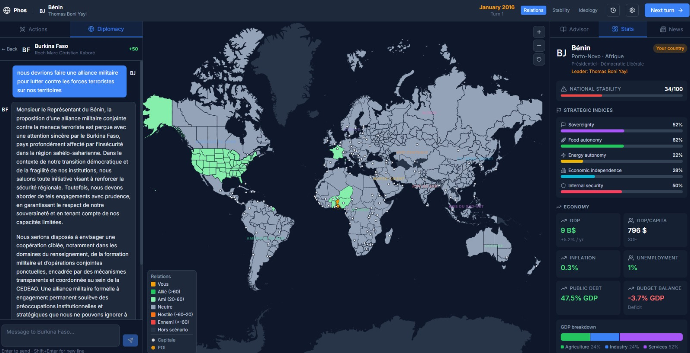
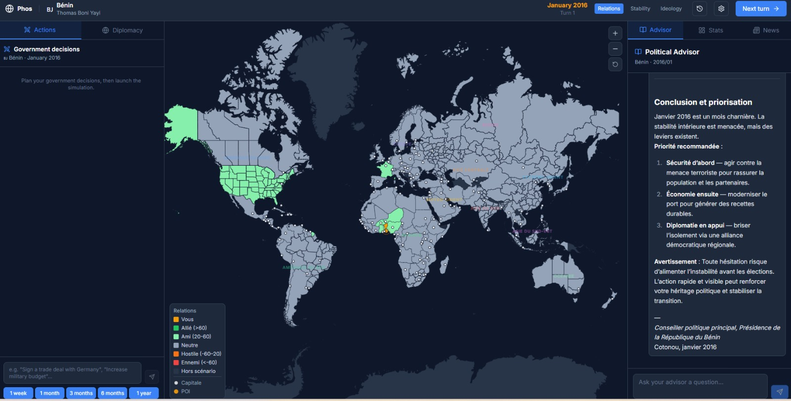
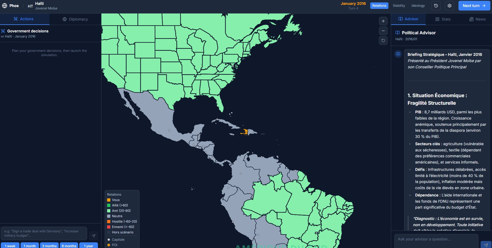

# Phos

OpenSource game inspired by the game Pax Historia

AI-powered geopolitical narrative simulation. Play as a nation, make political decisions, engage in real-time diplomacy with other countries through AI agents, and consult your political advisor.

<div align="center">
  
  <br/>
  
  
</div>

> Compatible with **[socle.ai](https://socle.ai)** (default), **[Ollama](https://ollama.com/)**, **[text-generation-webui](https://github.com/oobabooga/text-generation-webui)**, **[DeepSeek](https://deepseek.com/)** — works with any OpenAI-compatible endpoint. The API is configured directly in the app, no `.env` required.

You can create your own world and scenario (Warhammer 40k in preparation)

## Features

- **Interactive world map** — visualize diplomatic relations, stability, and ideology across countries
- **Included 2016 scenario** — 147 countries with realistic data (GDP, military, ideology, relations, nation briefs)
- **AI diplomacy** — negotiate in natural language with any country or group, streamed in real time
- **AI political advisor** — get strategic analyses and recommendations
- **Free actions** — submit any political action, the AI simulates its consequences
- **Turn simulation** — the AI generates world events each turn (1 month)
- **Custom scenarios** — build your own maps and factions from scratch (LotR, Star Wars, Warhammer 40k, Napoleonic Wars…)

---

## Quick start

### With Docker (recommended)

```bash
make up
```

Then open **http://localhost:5173** and configure your API in the app (top-right button).

### Local development (without Docker)

```bash
# Install dependencies
make install

# Start backend + frontend in parallel
make dev
```

Open **http://localhost:5173**

---

## API Configuration

The API is configured at runtime via the **Configure API** button in the app. Nothing to set up beforehand.

### Socle (default)

Get a free key at [socle.ai](https://socle.ai), then enter it in the app:
- **Base URL:** `https://app.socle.ai/api/v1`
- **API Key:** your key

### Ollama (local, free)

1. [Install Ollama](https://ollama.com/) and pull a model:
   ```bash
   ollama pull llama3.2
   ```
2. In the app, select **Ollama (local)** — the URL is pre-filled automatically:
   - **Base URL:** `http://host.docker.internal:11434/v1`
   - **API Key:** leave empty
   - **Model:** the name of your pulled model (e.g. `llama3.2`, `mistral`, `gemma4`)

> Recommended models: **llama3.2**, **mistral**, **qwen2.5** (≥ 7B). Smaller models may produce invalid JSON.

### TextGen / text-generation-webui (local, free)

1. [Install text-generation-webui](https://github.com/oobabooga/text-generation-webui) and load a model
2. Launch with the OpenAI-compatible API enabled:
   ```bash
   python server.py --api --listen
   ```
3. In the app, select **TextGen (local)**:
   - **Base URL:** `http://host.docker.internal:5000/v1`
   - **API Key:** leave empty
   - **Model:** `default` (or the name of the loaded model)

### DeepSeek

1. Get an API key at [deepseek.com](https://platform.deepseek.com/)
2. In the app, select **DeepSeek**:
   - **Base URL:** `https://api.deepseek.com/v1`
   - **API Key:** your key
   - **Model:** `deepseek-v4-flash` or `deepseek-chat`

### Other providers

Any OpenAI-compatible endpoint works — just set the Base URL and API key:

| Provider | Base URL |
|----------|----------|
| OpenAI | `https://api.openai.com/v1` |
| DeepSeek | `https://api.deepseek.com/v1` |
| Groq | `https://api.groq.com/openai/v1` |
| Ollama | `http://host.docker.internal:11434/v1` |
| TextGen | `http://host.docker.internal:5000/v1` |

---

## Makefile reference

| Command | Description |
|---------|-------------|
| `make up` | Build and start with Docker |
| `make down` | Stop containers |
| `make restart` | Restart containers |
| `make logs` | Follow container logs |
| `make install` | Install backend + frontend dependencies (local dev) |
| `make dev` | Start backend + frontend locally (no Docker) |
| `make dev-backend` | Start backend only |
| `make dev-frontend` | Start frontend only |

---

## Architecture

```
phos/
├── backend/                    # Python + FastAPI
│   ├── app/
│   │   ├── main.py             # FastAPI app + CORS
│   │   ├── config.py           # Configuration (env vars)
│   │   ├── models/             # Pydantic models (country, game, scenario)
│   │   ├── routers/            # API endpoints (game, diplomacy, advisor, scenarios)
│   │   ├── services/
│   │   │   ├── ai_service.py   # OpenAI-compatible AI client (SSE streaming)
│   │   │   ├── game_engine.py  # Game engine (sessions, turns, state)
│   │   │   └── scenario_loader.py
│   │   └── data/
│   │       └── scenarios/
│   │           └── default_2016.json  # World 2016 scenario (147 countries)
│   ├── Dockerfile
│   └── requirements.txt
│
├── frontend/                   # React + TypeScript + Vite
│   ├── src/
│   │   ├── App.tsx             # Routing
│   │   ├── pages/
│   │   │   ├── Home.tsx        # Scenario + country selection
│   │   │   └── Game.tsx        # Main game interface
│   │   ├── components/
│   │   │   ├── Map/WorldMap.tsx               # Interactive SVG map (react-simple-maps)
│   │   │   ├── Dashboard/CountryDashboard.tsx
│   │   │   ├── Diplomacy/DiplomacyPanel.tsx   # Diplomatic chat (SSE)
│   │   │   ├── Advisor/AdvisorPanel.tsx       # AI advisor (SSE)
│   │   │   └── UI/EventsFeed.tsx
│   │   ├── store/gameStore.ts  # Global state (Zustand)
│   │   ├── api/client.ts       # API calls + SSE streaming
│   │   └── types/index.ts
│   └── Dockerfile
│
└── docker-compose.yml
```

## REST API

| Method | Endpoint | Description |
|--------|----------|-------------|
| `GET` | `/api/scenarios/` | List scenarios |
| `GET` | `/api/scenarios/{id}` | Scenario details |
| `POST` | `/api/game/` | Create a session |
| `GET` | `/api/game/{session_id}` | Game state |
| `POST` | `/api/game/{session_id}/action` | Submit an action |
| `POST` | `/api/game/{session_id}/end-turn` | End turn |
| `POST` | `/api/diplomacy/{session_id}/message` | Diplomatic message (SSE) |
| `POST` | `/api/advisor/{session_id}/ask` | Ask the advisor (SSE) |
| `GET` | `/api/advisor/{session_id}/briefing` | Situation briefing (SSE) |

## Custom scenarios

Create a scenario via the API (`POST /api/scenarios/`) following the same format as `backend/app/data/scenarios/default_2016.json`, or use the in-app scenario editor. Custom scenarios are saved in `backend/app/data/custom_scenarios/`.

## Contributing

Contributions welcome! Inspired by the original [Pax Historia](https://wiki.paxhistoria.co/wiki/Main_Page) game.

## License

MIT
